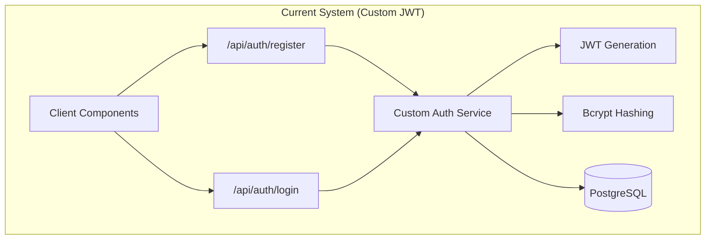
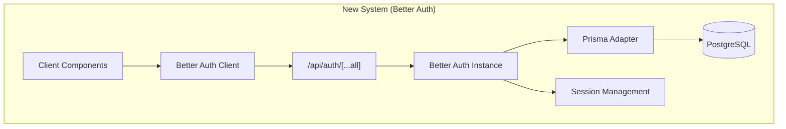
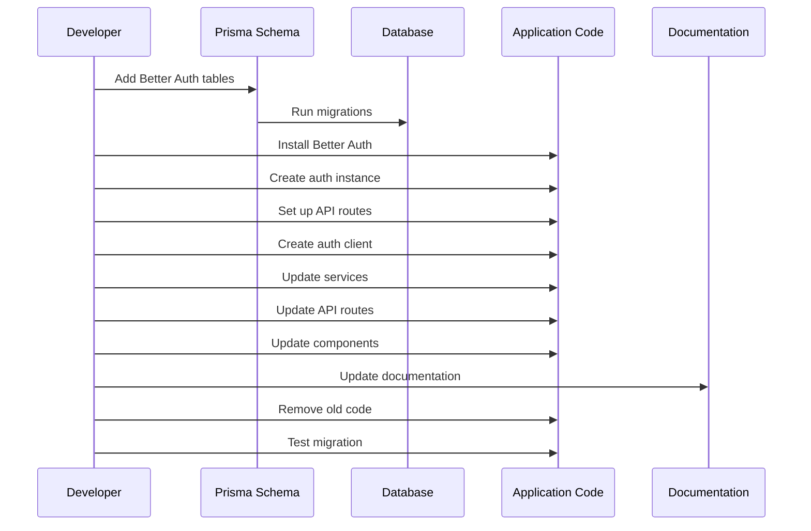

# Better Auth Migration Design Document

## Overview

This design document outlines the technical approach for migrating VoiceFlow AI from a custom JWT-based authentication system to Better Auth. Better Auth is a comprehensive, framework-agnostic authentication library that provides built-in support for email/password authentication, session management, and extensibility through plugins. This migration will reduce maintenance overhead, improve security through battle-tested implementations, and provide a foundation for future authentication features.

### Migration Goals

1. **Zero Downtime**: Migrate without disrupting existing users
2. **Data Preservation**: Maintain all existing user data and relationships
3. **Security Parity**: Match or exceed current security standards
4. **Feature Compatibility**: Preserve all existing authentication features
5. **Code Simplification**: Reduce custom authentication code by ~70%

### Key Benefits of Better Auth

- **Built-in Security**: Battle-tested password hashing (scrypt), session management, and CSRF protection
- **Framework Integration**: Native Next.js 15 support with App Router compatibility
- **Extensibility**: Plugin system for future features (2FA, OAuth, magic links)
- **Type Safety**: Full TypeScript support with generated types
- **Database Agnostic**: Works with Prisma, Drizzle, and other ORMs

## Architecture

### Current Authentication Architecture



### New Better Auth Architecture



### Migration Flow



## Components and Interfaces

### 1. Better Auth Server Instance

**File**: `src/lib/auth.ts`

```typescript
import { betterAuth } from "better-auth";
import { prismaAdapter } from "better-auth/adapters/prisma";
import { PrismaClient } from "@prisma/client";

const prisma = new PrismaClient();

export const auth = betterAuth({
  // Database configuration
  database: prismaAdapter(prisma, {
    provider: "postgresql",
  }),
  
  // Email and password authentication
  emailAndPassword: {
    enabled: true,
    minPasswordLength: 8,
    maxPasswordLength: 128,
    requireEmailVerification: false, // Can be enabled later
    autoSignIn: true, // Auto sign in after registration
  },
  
  // Base URL configuration
  baseURL: process.env.BETTER_AUTH_URL || "http://localhost:3000",
  
  // Secret for encryption and hashing
  secret: process.env.BETTER_AUTH_SECRET!,
  
  // Session configuration
  session: {
    expiresIn: 60 * 60 * 24 * 7, // 7 days (matching current JWT expiry)
    updateAge: 60 * 60 * 24, // Update session every 24 hours
    cookieCache: {
      enabled: true,
      maxAge: 5 * 60, // Cache for 5 minutes
    },
  },
  
  // Trusted origins for CORS (for future OAuth support)
  trustedOrigins: ["https://appleid.apple.com"],
  
  // Advanced options
  advanced: {
    generateId: () => crypto.randomUUID(), // Use UUID for consistency
    useSecureCookies: process.env.NODE_ENV === "production",
    crossSubDomainCookies: {
      enabled: false,
    },
  },
});

export type Session = typeof auth.$Infer.Session;
```

**Design Rationale**: 
- Uses Prisma adapter for seamless database integration
- Maintains 7-day session expiry matching current JWT implementation
- Configures secure cookies for production
- Exports type-safe session interface

### 2. Better Auth API Routes

**File**: `src/app/api/auth/[...all]/route.ts`

```typescript
import { auth } from "@/lib/auth";
import { toNextJsHandler } from "better-auth/next-js";

// Export GET and POST handlers for Next.js 15 App Router
export const { POST, GET } = toNextJsHandler(auth);

// Optional: Add custom middleware for Arcjet protection
export const runtime = "nodejs"; // Use Node.js runtime for better compatibility
```

**Design Rationale**:
- Catch-all route handles all Better Auth endpoints (`/api/auth/*`)
- Uses Next.js 15 App Router pattern with named exports
- Maintains compatibility with Arcjet security middleware

### 3. Better Auth Client Instance

**File**: `src/lib/auth-client.ts`

```typescript
import { createAuthClient } from "better-auth/react";

export const authClient = createAuthClient({
  baseURL: process.env.NEXT_PUBLIC_BETTER_AUTH_URL || "http://localhost:3000",
});

// Export commonly used methods for convenience
export const {
  signIn,
  signUp,
  signOut,
  useSession,
  getSession,
} = authClient;
```

**Design Rationale**:
- Uses React client for hooks support (useSession)
- Exports individual methods for cleaner imports
- Configurable base URL for different environments

### 4. Updated Authentication Service

**File**: `src/lib/services/auth.ts`

```typescript
import { auth } from "@/lib/auth";
import { prisma } from "@/lib/db";
import { generateEncryptionKey, hashEncryptionKey } from "./encryption";
import { createAuditLog } from "./audit";
import type { GDPRConsent } from "@/types/auth";

/**
 * Register a new user with Better Auth and custom fields
 */
export async function registerUser(
  email: string,
  password: string,
  gdprConsent: GDPRConsent,
  ipAddress?: string
) {
  // Generate encryption key for user
  const encryptionKey = generateEncryptionKey();
  const encryptionKeyHash = hashEncryptionKey(encryptionKey);

  // Create user with Better Auth
  const result = await auth.api.signUpEmail({
    body: {
      email,
      password,
      name: email.split("@")[0], // Default name from email
    },
  });

  if (!result.data?.user) {
    throw new Error("Failed to create user");
  }

  // Update user with custom fields (encryption key and GDPR consent)
  await prisma.user.update({
    where: { id: result.data.user.id },
    data: {
      encryptionKeyHash,
      gdprConsent: {
        ...gdprConsent,
        consentedAt: new Date(),
        ipAddress,
      },
    },
  });

  // Create audit log
  await createAuditLog({
    userId: result.data.user.id,
    action: "USER_REGISTERED",
    resourceType: "user",
    resourceId: result.data.user.id,
    details: {
      email,
      gdprConsent,
    },
    ipAddress,
  });

  return {
    user: result.data.user,
    session: result.data.session,
    encryptionKey,
  };
}

/**
 * Get session from request headers (server-side)
 */
export async function getServerSession(headers: Headers) {
  const session = await auth.api.getSession({
    headers,
  });

  return session;
}

/**
 * Update user's GDPR consent
 */
export async function updateGDPRConsent(
  userId: string,
  consent: GDPRConsent,
  ipAddress?: string
): Promise<void> {
  await prisma.user.update({
    where: { id: userId },
    data: {
      gdprConsent: {
        ...consent,
        consentedAt: new Date(),
        ipAddress,
      },
    },
  });

  await createAuditLog({
    userId,
    action: "GDPR_CONSENT_UPDATED",
    resourceType: "user",
    resourceId: userId,
    details: { consent },
    ipAddress,
  });
}
```

**Design Rationale**:
- Delegates authentication to Better Auth
- Preserves custom fields (encryptionKeyHash, gdprConsent)
- Maintains audit logging for compliance
- Provides server-side session helper

### 5. Protected API Route Pattern

**File**: `src/app/api/notes/route.ts` (example)

```typescript
import { NextRequest, NextResponse } from "next/server";
import { auth } from "@/lib/auth";
import { ajAuthAPI, handleArcjetDecision } from "@/lib/arcjet";
import { prisma } from "@/lib/db";

export async function GET(request: NextRequest) {
  // 1. Arcjet security protection
  const decision = await ajAuthAPI.protect(request);
  const errorResponse = handleArcjetDecision(decision);
  if (errorResponse) return errorResponse;

  // 2. Get session from Better Auth
  const session = await auth.api.getSession({
    headers: request.headers,
  });

  // 3. Check authentication
  if (!session?.user) {
    return NextResponse.json(
      { error: "Unauthorized" },
      { status: 401 }
    );
  }

  // 4. Business logic with authenticated user
  const notes = await prisma.note.findMany({
    where: { userId: session.user.id },
    orderBy: { createdAt: "desc" },
  });

  return NextResponse.json({ notes });
}
```

**Design Rationale**:
- Maintains Arcjet security protection
- Uses Better Auth session verification
- Follows existing API route structure
- Type-safe session access

### 6. Frontend Authentication Components

**File**: `src/components/auth/SignUpForm.tsx` (example)

```typescript
"use client";

import { useState } from "react";
import { authClient } from "@/lib/auth-client";
import { useRouter } from "next/navigation";

export function SignUpForm() {
  const [email, setEmail] = useState("");
  const [password, setPassword] = useState("");
  const [error, setError] = useState("");
  const [loading, setLoading] = useState(false);
  const router = useRouter();

  const handleSubmit = async (e: React.FormEvent) => {
    e.preventDefault();
    setError("");
    setLoading(true);

    try {
      const { data, error } = await authClient.signUp.email({
        email,
        password,
        name: email.split("@")[0],
        callbackURL: "/dashboard",
      }, {
        onRequest: () => {
          setLoading(true);
        },
        onSuccess: () => {
          router.push("/dashboard");
        },
        onError: (ctx) => {
          setError(ctx.error.message);
          setLoading(false);
        },
      });

      if (error) {
        setError(error.message);
      }
    } catch (err) {
      setError("An unexpected error occurred");
    } finally {
      setLoading(false);
    }
  };

  return (
    <form onSubmit={handleSubmit}>
      {/* Form fields */}
    </form>
  );
}
```

**File**: `src/components/auth/UserProfile.tsx` (example)

```typescript
"use client";

import { authClient } from "@/lib/auth-client";

export function UserProfile() {
  const { data: session, isPending, error } = authClient.useSession();

  if (isPending) {
    return <div>Loading...</div>;
  }

  if (!session?.user) {
    return <div>Not authenticated</div>;
  }

  return (
    <div>
      <p>Email: {session.user.email}</p>
      <button onClick={() => authClient.signOut()}>
        Sign Out
      </button>
    </div>
  );
}
```

**Design Rationale**:
- Uses Better Auth React hooks for reactive state
- Maintains existing UI/UX patterns
- Provides proper error handling
- Type-safe session access

## Data Models

### Updated Prisma Schema

The schema needs to be updated to include Better Auth's core tables while preserving existing custom fields.

**File**: `prisma/schema.prisma`

```prisma
// Better Auth core tables
model User {
  id                String    @id @default(dbgenerated("gen_random_uuid()")) @db.Uuid
  name              String    @db.VarChar(255)
  email             String    @unique @db.VarChar(255)
  emailVerified     Boolean   @default(false) @map("email_verified")
  image             String?   @db.Text
  createdAt         DateTime  @default(now()) @map("created_at") @db.Timestamptz(6)
  updatedAt         DateTime  @default(now()) @updatedAt @map("updated_at") @db.Timestamptz(6)
  
  // Custom fields (preserved from old schema)
  encryptionKeyHash String    @map("encryption_key_hash") @db.VarChar(255)
  gdprConsent       Json      @map("gdpr_consent")

  // Better Auth relations
  sessions          Session[]
  accounts          Account[]
  
  // Existing relations
  notes             Note[]
  folders           Folder[]
  tags              Tag[]
  auditLogs         AuditLog[]

  @@map("user")
}

model Session {
  id        String   @id @default(dbgenerated("gen_random_uuid()")) @db.Uuid
  expiresAt DateTime @map("expires_at") @db.Timestamptz(6)
  token     String   @unique @db.Text
  createdAt DateTime @default(now()) @map("created_at") @db.Timestamptz(6)
  updatedAt DateTime @default(now()) @updatedAt @map("updated_at") @db.Timestamptz(6)
  ipAddress String?  @map("ip_address") @db.VarChar(45)
  userAgent String?  @map("user_agent") @db.Text
  userId    String   @map("user_id") @db.Uuid

  user User @relation(fields: [userId], references: [id], onDelete: Cascade)

  @@index([userId])
  @@map("session")
}

model Account {
  id                String   @id @default(dbgenerated("gen_random_uuid()")) @db.Uuid
  accountId         String   @map("account_id") @db.VarChar(255)
  providerId        String   @map("provider_id") @db.VarChar(255)
  userId            String   @map("user_id") @db.Uuid
  accessToken       String?  @map("access_token") @db.Text
  refreshToken      String?  @map("refresh_token") @db.Text
  idToken           String?  @map("id_token") @db.Text
  accessTokenExpiresAt DateTime? @map("access_token_expires_at") @db.Timestamptz(6)
  refreshTokenExpiresAt DateTime? @map("refresh_token_expires_at") @db.Timestamptz(6)
  scope             String?  @db.Text
  password          String?  @db.Text
  createdAt         DateTime @default(now()) @map("created_at") @db.Timestamptz(6)
  updatedAt         DateTime @default(now()) @updatedAt @map("updated_at") @db.Timestamptz(6)

  user User @relation(fields: [userId], references: [id], onDelete: Cascade)

  @@unique([providerId, accountId])
  @@index([userId])
  @@map("account")
}

model Verification {
  id         String   @id @default(dbgenerated("gen_random_uuid()")) @db.Uuid
  identifier String   @db.VarChar(255)
  value      String   @db.Text
  expiresAt  DateTime @map("expires_at") @db.Timestamptz(6)
  createdAt  DateTime @default(now()) @map("created_at") @db.Timestamptz(6)
  updatedAt  DateTime @default(now()) @updatedAt @map("updated_at") @db.Timestamptz(6)

  @@unique([identifier, value])
  @@map("verification")
}

// Existing models remain unchanged (Note, Folder, Tag, NoteTag, AuditLog)
```

**Design Rationale**:
- Adds Better Auth core tables (Session, Account, Verification)
- Preserves custom fields in User model
- Maintains all existing relationships
- Uses consistent naming conventions with snake_case mapping

### Migration Strategy

1. **Schema Update**: Add Better Auth tables without removing old fields
2. **Data Preservation**: Existing users remain in database
3. **Password Migration**: Passwords will be re-hashed on first login with Better Auth
4. **Session Migration**: Old JWT sessions will expire naturally (7 days)

## Error Handling

### Authentication Errors

```typescript
// Error types from Better Auth
interface AuthError {
  message: string;
  code: string;
  status: number;
}

// Common error codes
const AUTH_ERRORS = {
  INVALID_CREDENTIALS: "Invalid email or password",
  USER_EXISTS: "User already exists",
  WEAK_PASSWORD: "Password must be at least 8 characters",
  SESSION_EXPIRED: "Session has expired, please log in again",
  UNAUTHORIZED: "You must be logged in to access this resource",
};
```

### Error Handling Pattern

```typescript
// Client-side error handling
const { data, error } = await authClient.signIn.email({
  email,
  password,
}, {
  onError: (ctx) => {
    // Handle specific error codes
    if (ctx.error.status === 401) {
      setError("Invalid credentials");
    } else if (ctx.error.status === 429) {
      setError("Too many attempts, please try again later");
    } else {
      setError(ctx.error.message);
    }
  },
});

// Server-side error handling
try {
  const session = await auth.api.getSession({ headers });
  if (!session?.user) {
    return NextResponse.json(
      { error: "Unauthorized" },
      { status: 401 }
    );
  }
} catch (error) {
  console.error("Session error:", error);
  return NextResponse.json(
    { error: "Authentication failed" },
    { status: 500 }
  );
}
```

**Design Rationale**:
- Consistent error handling across client and server
- User-friendly error messages
- Proper HTTP status codes
- Maintains Arcjet rate limiting integration

## Testing Strategy

### Unit Tests

```typescript
// Test Better Auth integration
describe("Better Auth Integration", () => {
  it("should register a new user", async () => {
    const result = await registerUser(
      "test@example.com",
      "password123",
      mockGDPRConsent,
      "127.0.0.1"
    );
    
    expect(result.user).toBeDefined();
    expect(result.session).toBeDefined();
    expect(result.encryptionKey).toBeDefined();
  });

  it("should authenticate existing user", async () => {
    const session = await auth.api.signInEmail({
      body: {
        email: "test@example.com",
        password: "password123",
      },
    });
    
    expect(session.data?.user).toBeDefined();
    expect(session.data?.session).toBeDefined();
  });

  it("should verify session on protected routes", async () => {
    const headers = new Headers();
    headers.set("cookie", `better-auth.session_token=${sessionToken}`);
    
    const session = await auth.api.getSession({ headers });
    expect(session?.user).toBeDefined();
  });
});
```

### Integration Tests

```typescript
// Test complete authentication flow
describe("Authentication Flow", () => {
  it("should complete registration to protected route flow", async () => {
    // 1. Register user
    const { data: signUpData } = await authClient.signUp.email({
      email: "newuser@example.com",
      password: "securepass123",
    });
    expect(signUpData?.user).toBeDefined();

    // 2. Access protected route
    const response = await fetch("/api/notes", {
      headers: {
        cookie: `better-auth.session_token=${signUpData.session.token}`,
      },
    });
    expect(response.status).toBe(200);

    // 3. Sign out
    await authClient.signOut();

    // 4. Verify session is invalid
    const response2 = await fetch("/api/notes");
    expect(response2.status).toBe(401);
  });
});
```

### Migration Tests

```typescript
// Test data preservation during migration
describe("Migration Data Integrity", () => {
  it("should preserve existing user data", async () => {
    const user = await prisma.user.findUnique({
      where: { email: "existing@example.com" },
    });
    
    expect(user?.encryptionKeyHash).toBeDefined();
    expect(user?.gdprConsent).toBeDefined();
    expect(user?.notes).toBeDefined();
  });

  it("should maintain existing relationships", async () => {
    const user = await prisma.user.findUnique({
      where: { email: "existing@example.com" },
      include: {
        notes: true,
        folders: true,
        tags: true,
      },
    });
    
    expect(user?.notes.length).toBeGreaterThan(0);
  });
});
```

**Design Rationale**:
- Comprehensive test coverage for authentication flows
- Data integrity verification
- Integration with existing test infrastructure
- Maintains existing test patterns

## Security Considerations

### Password Security

- **Hashing Algorithm**: Better Auth uses `scrypt` (OWASP recommended)
- **Migration**: Existing bcrypt hashes will be re-hashed on first login
- **Strength**: Minimum 8 characters (configurable)

### Session Security

- **Storage**: HTTP-only cookies (prevents XSS)
- **Encryption**: Session tokens are encrypted
- **Expiry**: 7-day expiry with automatic refresh
- **CSRF Protection**: Built-in CSRF token validation

### API Security

- **Arcjet Integration**: Maintains existing rate limiting and bot protection
- **CORS**: Configured trusted origins for future OAuth
- **Headers**: Secure cookie settings in production

### GDPR Compliance

- **Data Preservation**: All GDPR consent data maintained
- **Audit Logging**: Authentication events logged
- **Data Export**: User data export functionality preserved
- **Right to Deletion**: User deletion functionality preserved

## Performance Considerations

### Database Optimization

- **Connection Pooling**: Prisma connection pooling maintained
- **Indexes**: Session and account tables properly indexed
- **Query Optimization**: Efficient session lookups

### Caching Strategy

- **Session Caching**: 5-minute cookie cache for reduced DB queries
- **CDN**: Static assets cached at edge
- **Redis**: Future consideration for session storage

### Response Times

- **Session Verification**: <50ms (in-memory cookie cache)
- **Authentication**: <200ms (database query + hashing)
- **API Routes**: Maintains <500ms P95 target

## Migration Checklist

### Phase 1: Preparation
- [ ] Install Better Auth package
- [ ] Update Prisma schema with Better Auth tables
- [ ] Run database migrations
- [ ] Set environment variables

### Phase 2: Implementation
- [ ] Create Better Auth server instance
- [ ] Set up API routes
- [ ] Create Better Auth client
- [ ] Update authentication service
- [ ] Update protected API routes

### Phase 3: Frontend
- [ ] Update sign-up components
- [ ] Update sign-in components
- [ ] Update session hooks
- [ ] Update protected pages

### Phase 4: Documentation
- [ ] Update AUTHENTICATION.md
- [ ] Update tech steering docs
- [ ] Update structure steering docs
- [ ] Update security steering docs

### Phase 5: Testing & Cleanup
- [ ] Run unit tests
- [ ] Run integration tests
- [ ] Test migration with existing data
- [ ] Remove old dependencies
- [ ] Remove old auth code
- [ ] Remove old API routes

### Phase 6: Deployment
- [ ] Deploy to staging
- [ ] Verify authentication works
- [ ] Monitor error rates
- [ ] Deploy to production
- [ ] Monitor performance metrics

## Rollback Plan

If issues arise during migration:

1. **Immediate Rollback**: Revert to previous deployment
2. **Database Rollback**: Prisma migrations can be rolled back
3. **Code Rollback**: Git revert to previous commit
4. **Session Handling**: Old JWT sessions will continue to work during rollback period

## Future Enhancements

With Better Auth in place, future authentication features become easier:

1. **Two-Factor Authentication**: Add 2FA plugin
2. **OAuth Providers**: Add Google, GitHub, Apple sign-in
3. **Magic Links**: Passwordless authentication
4. **Passkeys**: WebAuthn support
5. **Multi-Session**: Multiple device sessions
6. **Organization Support**: Multi-tenancy plugin

**Design Rationale**: Better Auth's plugin ecosystem makes these features trivial to add compared to custom implementation.
