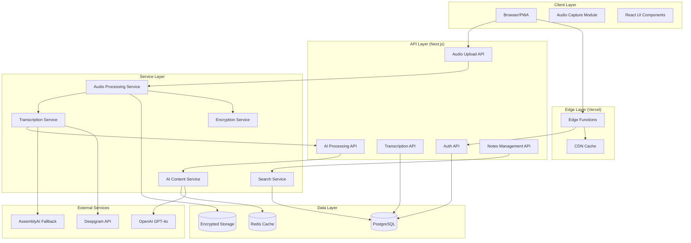

# VoiceFlow AI Design Document

## Overview

VoiceFlow AI is a production-ready voice note-taking application that combines real-time audio recording, AI-powered transcription, and intelligent content processing. The system is built on Next.js 15 with a focus on security, performance, and GDPR compliance while maintaining cost efficiency through optimized AI service usage.

### Key Design Principles

1. **Security First**: End-to-end encryption with AES-256-GCM and TLS 1.3 for all data transmission
2. **Performance Optimized**: Sub-500ms API response times with CDN delivery and parallel processing
3. **Cost Efficient**: Intelligent AI model selection and caching to maintain 94-97% gross margins
4. **Privacy Compliant**: GDPR-compliant data handling with user-controlled encryption keys
5. **Graceful Degradation**: Fallback mechanisms for transcription and AI processing failures

### Technology Stack

- **Frontend**: Next.js 15 (App Router), React 19, TypeScript
- **Audio Processing**: Web Audio API with MediaRecorder, Opus codec at 64 kbps
- **AI Services**: 
  - Primary Transcription: Deepgram Nova-2
  - Fallback Transcription: AssemblyAI
  - Content Processing: OpenAI GPT-4o
- **Database**: PostgreSQL with Prisma ORM
- **Storage**: Encrypted object storage (S3-compatible)
- **Infrastructure**: Vercel Edge Functions, CDN with 99% cache hit rate
- **Monitoring**: Structured logging with error tracking and performance metrics

## Architecture

### System Architecture



### Component Architecture

The system follows a layered architecture with clear separation of concerns:

1. **Client Layer**: Browser-based PWA with audio capture and React UI
2. **Edge Layer**: Vercel Edge Functions for global distribution and CDN caching
3. **API Layer**: Next.js API routes handling different functional domains
4. **Service Layer**: Business logic services with specific responsibilities
5. **Data Layer**: PostgreSQL for structured data, encrypted object storage for audio files

### Performance Architecture

- **Parallel Processing**: Audio transcription and AI processing run concurrently
- **Streaming**: Real-time transcription with WebSocket connections for <500ms latency
- **Caching Strategy**: Multi-level caching (CDN, Redis, browser) for optimal performance
- **Auto-scaling**: Database connection pooling and serverless function scaling

## Components and Interfaces

### Frontend Components

#### Audio Recording Component
```typescript
interface AudioRecorderProps {
  onRecordingComplete: (audioBlob: Blob, duration: number) => void;
  onError: (error: AudioError) => void;
  maxDuration?: number;
}

interface AudioRecorderState {
  isRecording: boolean;
  duration: number;
  audioLevel: number;
  error: AudioError | null;
}
```

**Design Rationale**: Encapsulates all audio recording logic with clear error handling and real-time feedback to meet Requirements 1.1-1.5.

#### Notes Management Component
```typescript
interface NotesManagerProps {
  userId: string;
  folderId?: string;
  searchQuery?: string;
}

interface Note {
  id: string;
  title: string;
  transcription: string;
  summary: string;
  audioUrl: string;
  duration: number;
  createdAt: Date;
  tags: string[];
  folderId: string;
  metadata: NoteMetadata;
}
```

**Design Rationale**: Supports hierarchical organization and tagging as specified in Requirements 4.1-4.5.

### Backend Services

#### Audio Processing Service
```typescript
interface AudioProcessingService {
  uploadAudio(file: File, userId: string): Promise<AudioUploadResult>;
  encryptAudio(audioData: Buffer, userKey: string): Promise<EncryptedAudio>;
  validateAudioFormat(file: File): Promise<ValidationResult>;
}

interface AudioUploadResult {
  audioId: string;
  encryptedUrl: string;
  duration: number;
  format: AudioFormat;
}
```

**Design Rationale**: Handles audio upload, encryption (Requirement 5.1, 5.3), and format validation (Requirement 1.3).

#### Transcription Service
```typescript
interface TranscriptionService {
  transcribeAudio(audioId: string, options: TranscriptionOptions): Promise<TranscriptionResult>;
  streamTranscription(audioStream: ReadableStream): AsyncGenerator<TranscriptionChunk>;
  fallbackTranscription(audioId: string): Promise<TranscriptionResult>;
}

interface TranscriptionResult {
  text: string;
  confidence: number;
  speakers?: SpeakerSegment[];
  processingTime: number;
  provider: 'deepgram' | 'assemblyai';
}
```

**Design Rationale**: Primary/fallback provider pattern ensures reliability (Requirements 2.1-2.5) with speaker diarization support.

#### AI Content Service
```typescript
interface AIContentService {
  generateSummary(transcription: string): Promise<ContentSummary>;
  extractInsights(transcription: string): Promise<ContentInsights>;
  moderateContent(text: string): Promise<ModerationResult>;
}

interface ContentSummary {
  summary: string;
  keyPoints: string[];
  actionItems: ActionItem[];
  importantDates: Date[];
  confidence: number;
}
```

**Design Rationale**: Structured AI processing with content moderation to meet Requirements 3.1-3.5.

### API Interfaces

#### Authentication API
```typescript
// POST /api/auth/consent
interface ConsentRequest {
  userId: string;
  consentTypes: ConsentType[];
  timestamp: Date;
}

// GET /api/auth/gdpr/export
interface DataExportRequest {
  userId: string;
  format: 'json' | 'zip';
}
```

**Design Rationale**: GDPR compliance endpoints for consent management and data export (Requirements 6.1-6.5).

#### Notes API
```typescript
// GET /api/notes/search
interface SearchRequest {
  query: string;
  userId: string;
  filters?: SearchFilters;
}

interface SearchResponse {
  results: SearchResult[];
  totalCount: number;
  responseTime: number;
}
```

**Design Rationale**: Full-text search with performance tracking to meet Requirement 4.2 (<100ms response time).

## Data Models

### Core Data Models

#### User Model
```sql
CREATE TABLE users (
  id UUID PRIMARY KEY DEFAULT gen_random_uuid(),
  email VARCHAR(255) UNIQUE NOT NULL,
  encryption_key_hash VARCHAR(255) NOT NULL,
  gdpr_consent JSONB NOT NULL,
  created_at TIMESTAMP WITH TIME ZONE DEFAULT NOW(),
  updated_at TIMESTAMP WITH TIME ZONE DEFAULT NOW()
);
```

#### Note Model
```sql
CREATE TABLE notes (
  id UUID PRIMARY KEY DEFAULT gen_random_uuid(),
  user_id UUID REFERENCES users(id) ON DELETE CASCADE,
  folder_id UUID REFERENCES folders(id),
  title VARCHAR(255) NOT NULL,
  transcription TEXT,
  summary TEXT,
  audio_url VARCHAR(500),
  encrypted_audio_key VARCHAR(255),
  duration INTEGER, -- in seconds
  metadata JSONB,
  created_at TIMESTAMP WITH TIME ZONE DEFAULT NOW(),
  updated_at TIMESTAMP WITH TIME ZONE DEFAULT NOW()
);

CREATE INDEX idx_notes_user_id ON notes(user_id);
CREATE INDEX idx_notes_created_at ON notes(created_at);
CREATE INDEX idx_notes_transcription_fts ON notes USING gin(to_tsvector('english', transcription));
```

#### Folder Model
```sql
CREATE TABLE folders (
  id UUID PRIMARY KEY DEFAULT gen_random_uuid(),
  user_id UUID REFERENCES users(id) ON DELETE CASCADE,
  parent_id UUID REFERENCES folders(id),
  name VARCHAR(255) NOT NULL,
  created_at TIMESTAMP WITH TIME ZONE DEFAULT NOW()
);
```

#### Tag Model
```sql
CREATE TABLE tags (
  id UUID PRIMARY KEY DEFAULT gen_random_uuid(),
  user_id UUID REFERENCES users(id) ON DELETE CASCADE,
  name VARCHAR(100) NOT NULL,
  UNIQUE(user_id, name)
);

CREATE TABLE note_tags (
  note_id UUID REFERENCES notes(id) ON DELETE CASCADE,
  tag_id UUID REFERENCES tags(id) ON DELETE CASCADE,
  PRIMARY KEY (note_id, tag_id)
);
```

**Design Rationale**: PostgreSQL with full-text search indexes for performance (Requirement 4.2), hierarchical folder support (Requirement 4.3), and proper foreign key constraints for data integrity.

### Audit and Compliance Models

#### Audit Log Model
```sql
CREATE TABLE audit_logs (
  id UUID PRIMARY KEY DEFAULT gen_random_uuid(),
  user_id UUID REFERENCES users(id),
  action VARCHAR(100) NOT NULL,
  resource_type VARCHAR(50) NOT NULL,
  resource_id UUID,
  details JSONB,
  ip_address INET,
  user_agent TEXT,
  created_at TIMESTAMP WITH TIME ZONE DEFAULT NOW()
);

CREATE INDEX idx_audit_logs_user_id ON audit_logs(user_id);
CREATE INDEX idx_audit_logs_created_at ON audit_logs(created_at);
```

**Design Rationale**: Comprehensive audit logging for GDPR compliance (Requirement 6.5) and security monitoring (Requirement 9.4).

## Error Handling

### Error Classification

1. **Client Errors (4xx)**
   - Audio format validation failures
   - Authentication/authorization errors
   - Rate limiting violations

2. **Server Errors (5xx)**
   - Transcription service failures
   - AI processing timeouts
   - Database connection issues

3. **External Service Errors**
   - Deepgram API failures → AssemblyAI fallback
   - OpenAI API failures → Graceful degradation

### Error Response Format
```typescript
interface ErrorResponse {
  error: {
    code: string;
    message: string;
    details?: any;
    retryable: boolean;
    fallbackAvailable: boolean;
  };
  requestId: string;
  timestamp: string;
}
```

### Fallback Strategies

1. **Transcription Fallback**: Deepgram → AssemblyAI → Manual transcription option
2. **AI Processing Fallback**: GPT-4o → GPT-4 → Transcription-only mode
3. **Storage Fallback**: Primary S3 → Secondary S3 region
4. **CDN Fallback**: Primary CDN → Origin server

**Design Rationale**: Multi-level fallbacks ensure system reliability and meet Requirements 2.4, 3.4, and the graceful degradation principle.

## Testing Strategy

### Unit Testing
- **Frontend Components**: React Testing Library with Jest
- **API Routes**: Next.js API testing with mock external services
- **Service Layer**: Isolated unit tests with dependency injection
- **Database Layer**: Prisma testing with test database

### Integration Testing
- **Audio Pipeline**: End-to-end audio upload → transcription → AI processing
- **Authentication Flow**: GDPR consent → user registration → data access
- **Search Functionality**: Full-text search across different content types

### Performance Testing
- **Load Testing**: Artillery.js for API endpoint stress testing
- **Audio Processing**: Concurrent transcription load testing
- **Database Performance**: Query performance under load

### Security Testing
- **Encryption Validation**: AES-256-GCM implementation testing
- **GDPR Compliance**: Data export/deletion verification
- **Input Validation**: Audio file format and size validation

### Monitoring and Observability

#### Application Metrics
```typescript
interface PerformanceMetrics {
  apiResponseTime: number; // P95 < 500ms (Requirement 7.2)
  transcriptionSpeed: number; // 5-10x real-time (Requirement 7.3)
  errorRate: number;
  activeUsers: number;
  costPerUser: number; // ≤$0.31 monthly (Requirement 10.2)
}
```

#### Health Checks
- Database connectivity and query performance
- External service availability (Deepgram, AssemblyAI, OpenAI)
- Storage system accessibility
- CDN performance metrics

#### Alerting Thresholds
- API response time P95 > 500ms
- Error rate > 1%
- Transcription accuracy < 90%
- Cost per user > $0.35
- Security events detected

**Design Rationale**: Comprehensive monitoring ensures SLA compliance and early detection of issues (Requirements 7.1-7.5, 9.1-9.5).

### Cost Optimization Strategy

#### AI Service Optimization
1. **Intelligent Model Selection**: Use smaller models for simple tasks
2. **Response Caching**: Cache AI responses for similar content
3. **Batch Processing**: Group similar requests for efficiency
4. **Usage Caps**: Implement tiered limits per user plan

#### Infrastructure Optimization
1. **CDN Caching**: 99% cache hit rate for static assets
2. **Database Optimization**: Connection pooling and query optimization
3. **Serverless Scaling**: Pay-per-use with Vercel Edge Functions
4. **Storage Tiering**: Move old audio files to cheaper storage tiers

**Design Rationale**: Multi-faceted cost optimization maintains 94-97% gross margins while ensuring performance (Requirements 10.1-10.5).
